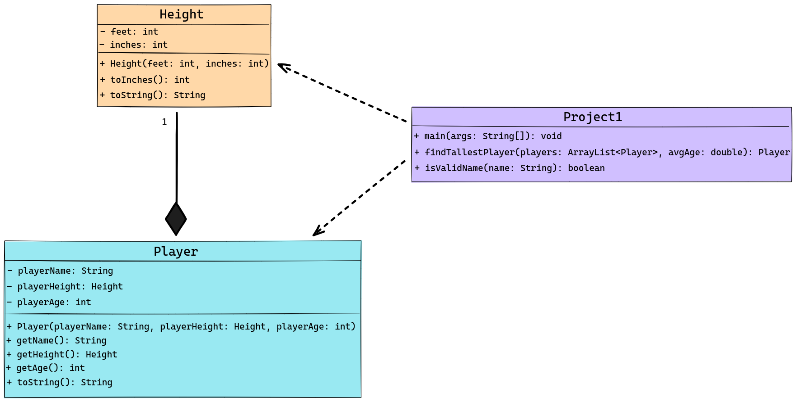

<!-- Title -->
<h1 align="center">Player Analysis Program</h1>

<i>This program began without Maven configuration, focusing initially on basic test classes similar to `PTest.java`. Transitioning to a Maven build with JUnit integration was a key part of the development, enhancing the project's structure and testing capabilities.</i>

---

<h2 align="center">Tech Used 🧰</h2>

<!-- Tech Stack -->

<kbd>
 |  | 
  
  </kbd>

## User Guide 📔

### Option 1️⃣ : Running as a Maven Project

1. **Setup**: Ensure Java and Maven are installed.
2. **Download**: Download and unzip project files.
3. **Building**: Run `mvn clean install` in the project's root directory.
4. **Running the Application**: Use `java -cp target/your-jar-file-name.jar com.yourpackage.Project1`.
5. **Running Tests**: Execute `mvn test`.

### Option 2️⃣ : Running Without Maven

1. **Java Installation**: Ensure Java is installed.
2. **Download**: Get `.java` files for `Height`, `Player`, and `Project1`.
3. **Compilation**: Compile with `javac Height.java Player.java Project1.java`.
4. **Execution**: Run `java Project1`.

## Lessons Learned

During the development of the player analysis program, I enhanced my skills in software development, particularly in understanding the Maven build process and JUnit testing. This experience reinforced Maven's role in project structure and management, while my exploration of JUnit highlighted the importance of testing for software quality. Additionally, I deepened my knowledge of core Java concepts like the @Override annotation and method scopes, leading to improvements in code clarity, efficiency, and maintainability.

## Possible Improvements

Reflecting on the player analysis program, a key improvement would be starting with Maven from the outset, which would have streamlined development. This highlighted the value of integrating new technologies early on. For future projects, adopting Test Driven Development (TDD) and exploring various build frameworks and testing tools are priorities. These steps aim to enhance software quality and expand my adaptability and technical skills in software development.

---

### UML Diagram

<b>See Diagram</b>

 
For more information, see the  documentation and User Guide.

---

<h2 align="center">Contact Me 🦄</h2>
<!-- Contact Me -->

<kbd>
 |  |  | 
  </kbd>

